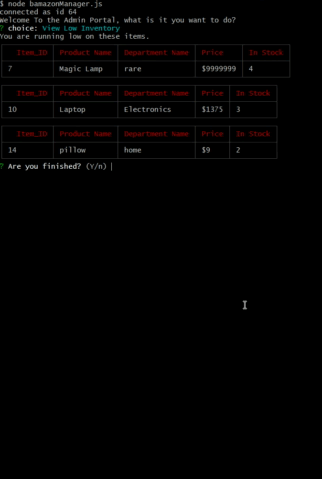

# AmazonMySql

> 

## Project Summary
The app will use node.js and MySql to take in orders from customers and deplete stock from the store's inventory. 

## Developers

- Developer 2: Kitrick Bell
  - Portfolio
  - Github
  - LinkedIn

## Animated Gifs/Pictures of App

## Customer View

## Manager View

-Displaying the Products in the database

-Displaying Items that have Low Inventory (less than 5)

-Adding inventory to existing products

-Adding new Products to the database

## Tech Stack

- HTML5,CSS,JS
- Bootstrap, jQuery , Node

## APIs

n/a

## MVP

- 

## Stretch Goals

## Future Development

-

## Credits/Resources
